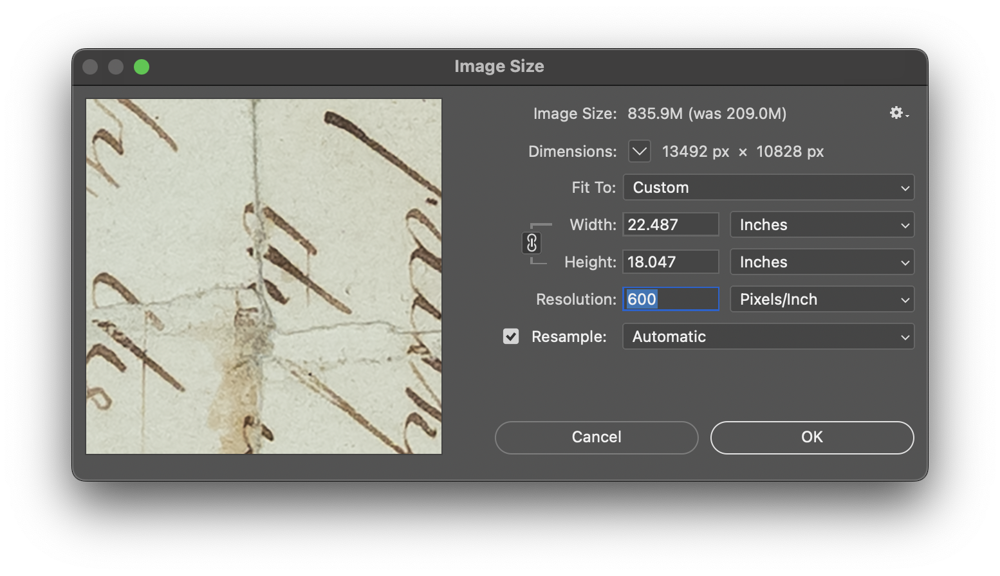
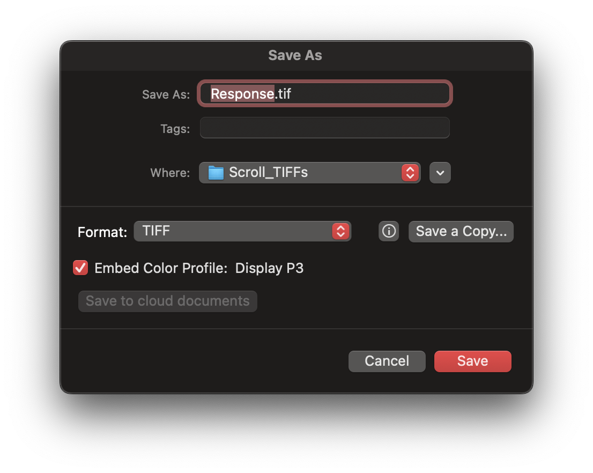
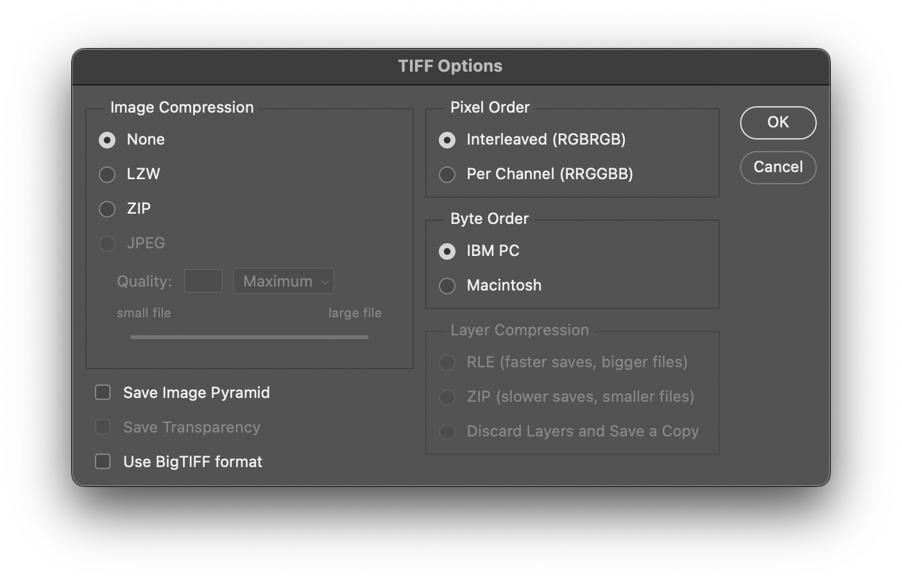

# How to Process Photographs for Archival Storage

## Pre-Requisites

- RAW photographs stored locally on device. 
- Adobe Photoshop

:::warning
Last tested on March 2025 release (version 26.5)
:::

## Step-by-Step Guide

Make sure all the images are located in a single folder in order. 

:::tip
Rename RAW images by number. For example '001.ARW, 002.ARW ...'
:::

1. Open Photoshop and click 'Open'.
2. In the pop-up window, navigate to your folder and select all the images. 

:::warning
Depending on the file size and number of photos, it may take several minutes to load all the photos.
:::

3. A Camera Raw window will pop-up. 

4. Press the shortcut key Command+A (mac) or CTRL+A (windows) to select all photos. 
5. Select the Color heading and make sure white balance is set to "As Shot".

6. Now, select the Optics heading and enable 'Remove chromatic aberration' and 'Use profile corrections'.

7. Click on the crop icon on the top-right navigation bar and set the preset to 'Full'.

:::tip
This step removes any crop set by the camera. 
:::

8. Finally click 'Open' in the bottom right corner. You might need to wait several minutes before Photoshop completes loading all the images. 

9. Select the crop tool from the sidebar on the left.

10. Crop the image appropriately, leaving some margin on all sides. 

11. Go to 'Image' in the top bar and select 'Image Size'. Set resolution to 600 to reduce pixel distortion while zooming in.

12. Go to 'File' in the top right bar and select 'Save as..'.

13. Choose the TIFF format and save into a different destination folder. 

14. Another window will pop up. Select the following options:

15. Now, follow steps 9-13 for the rest of your images. 

:::tip
You can view shorcut keys for 'Save as...' and 'Image Size' to make it easier for bulk processing. 
:::

## Conclusion

You are now ready to upload the exported images to Islandora or any archival storage service! 