# How to 3D Scan Using the RevoPoint POP3 3D Scanner

## Pre-Requisites

- The RevoScan5 software must be downloaded to your device. This is link details how to do so: https://www.revopoint3d.com/pages/support. There are also a few tutorials that provide a general idea of the process.
- The RevoPoint Scanner is located in the big closet in the LibLab Kitchen, ask for the key at the circulation desk. 

## Step-by-Step Guide

1. On your laptop, launch the Revo Scan 5 app.
2. Click “New Project” and name the project with an appropriate name.
3. Select a folder to which the file is saved (Projects are saved in the Revopoint project folder by default).
4. Prepare a surface to scan. Use either the scanning mat or the dual-axis turntable.
    - Center the object you want to scan on the turntable, and plug the barrel connector into the turntable.
    - Check that the turntable is connected by going to Accessories > Dual-axis Turntable > Connection. Under My Devices, ensure that it is connected, then click Save.

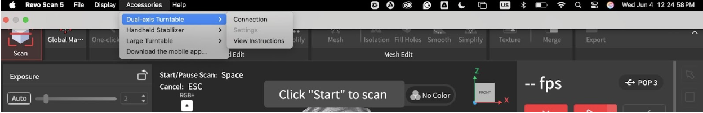

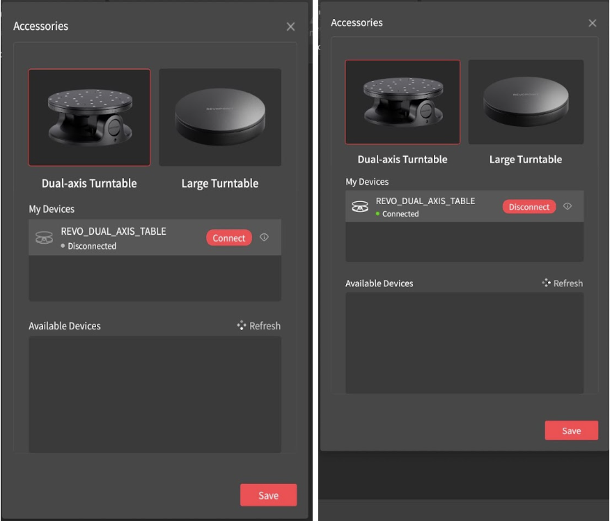

5. There are a few options for scanning with the available accessories: You can attach the scanner to the scanner handle (tripod), handheld stabilizer (gimbal), or attach your phone with the mount.
6. Connect the scanner to a device, either a laptop or a mobile device. If you are using the gimbal, you can connect the scanner to the device using Wi-Fi (In your network settings, select the Wi-Fi network corresponding to the Pop3 Scanner); otherwise, connect it using a USB-C cable. 
7. Wait until the program says “Connected,” it will then prompt you to start by turning the Start and Pause buttons red on the right-hand menu.
8. Position the scanner to view the object between the “good” and “excellent range” of the scale on the right. 

:::tip
Throughout the process, this scale will tell you whether you must move the scanner closer to or farther away from the object.
:::

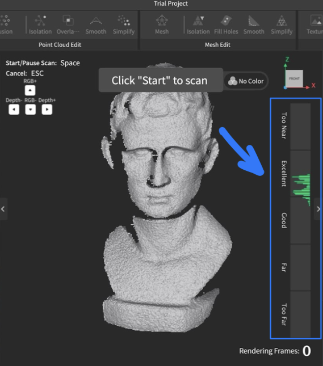

9. Under Scan Settings on the right, go through and pick the desired settings:
    - Under Accuracy, it may be helpful to select “High Accuracy,” which is better for Merging.
    - Objects with complex geometry benefit from “Feature Tracking,” while objects with flatter surfaces benefit from “Marker Tracking,” in which markers must be placed on the object.
    - Make sure “Color Scanning” is toggled off for the first pass, this simplifies the process.

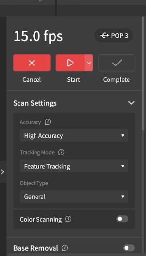

- In Marker mode, at least 5 markers should be detected within the viewport for the scan to start successfully. The RevoScan program may otherwise prompt you to add more markers.

:::warning
 Markers may leave residue or damage fragile surfaces. Do not use them on rare, archival, or fragile objects.
:::
 
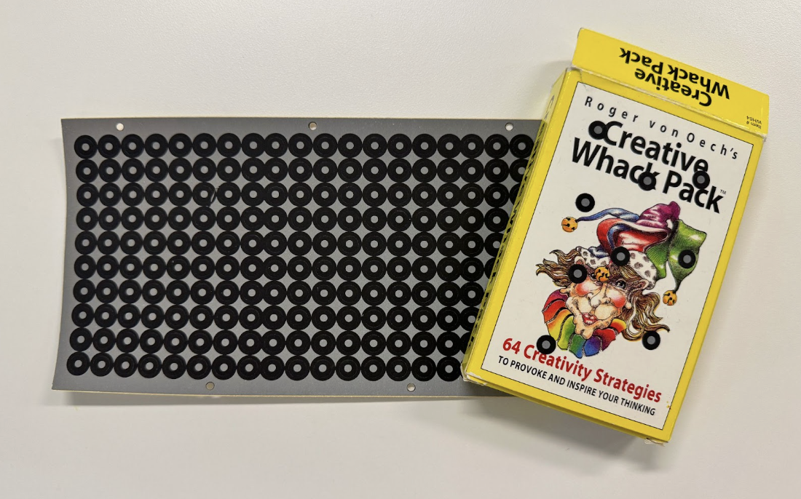

10. Check the viewport on the bottom left of the screen to make sure the object is centered. Keep checking this viewport to ensure the object is in view, as the main scan does not accurately represent the scanner’s position.

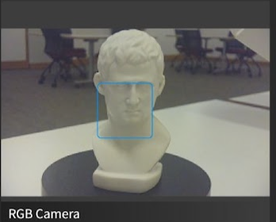

11. In the exposure view, blue indicates underexposure and red indicates overexposure. Turn on “Auto” so that the program adjusts the exposure automatically, or adjust exposure manually.

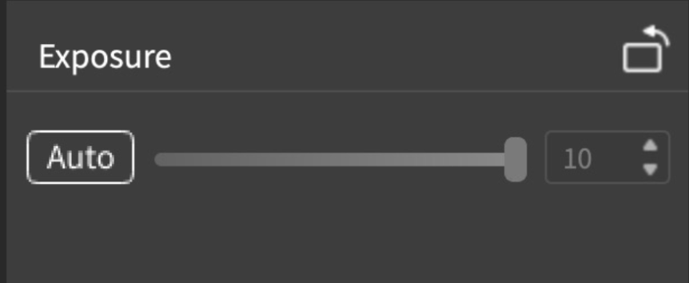
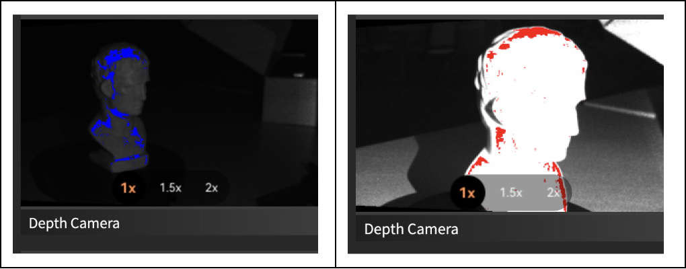

12. Press the red Start button on the top right
13. During the scan, the main screen will display the scan. The different colors mean different things:
    - Blue areas have been successfully scanned.
    - Green areas are being scanned/recognized.
    - Red areas are unable to be scanned (e.g., Flat surfaces with not enough features that need markers).

:::tip
- If the scanning area shows errors (scans off-axis or loss of tracking), click “Pause” and Undo (available through the hotkeys Cmd-Z or Ctrl-Z only) until you achieve your desired result.
- If you can’t capture the whole object in one scan, you can make multiple scans and Merge them (can only merge two scans at a time).
:::

## Here's How to Merge

1. Take the partial scans and save them separately. Ensure there is sufficient overlap between the scans, and make sure the positioning from each angle is preserved, otherwise, the merge will be crooked.
2. Before merging, select the first scan and click the “Fusion” button, then “Apply.” Take note of the point distance because it should be the same in both scans. Then click “Isolation,” then  “Detect” and “Apply”, do the same for “Overlap Detection.” Repeat this process for the second scan.

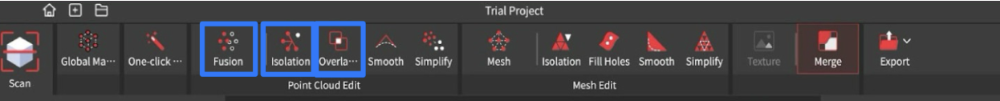

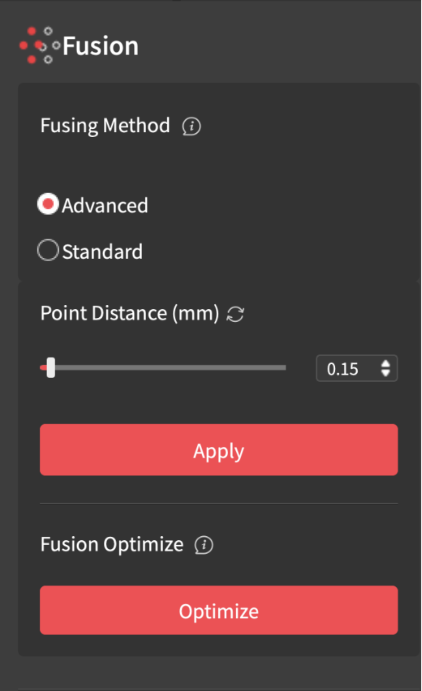

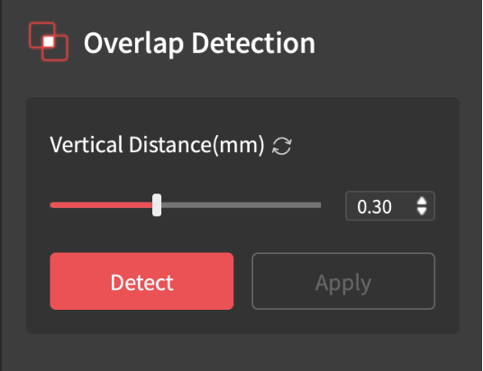

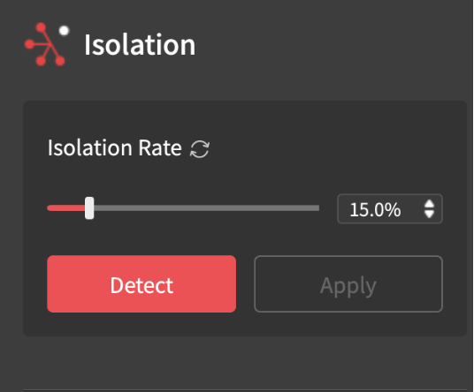

3. Then click the “Merge” button and select both files. There are two options depending on the object. Feature Merging automatically aligns the two files based on overlapping features. Marker Merging involves manually aligning the scans by placing markers on them. 

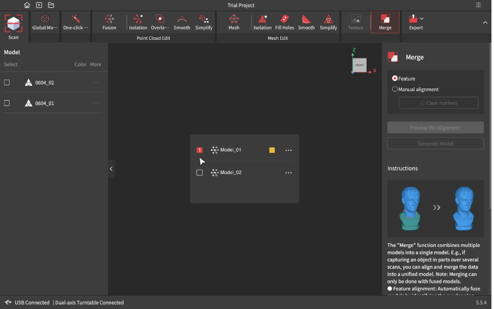

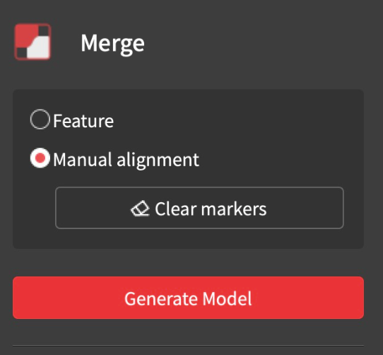

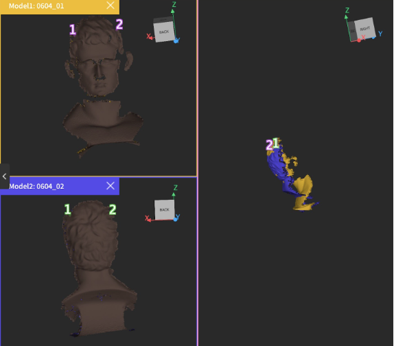

- If you select Marker Merging (for when the object doesn’t have a lot of features 
or Feature Merging doesn’t produce a correct result), you must place the corresponding numbers (refer to the picture above) on each scan at the locations you want to align. 
- To individually deselect markers, hover over a number until it turns red and click it while it’s red. This may be useful in troubleshooting when the scans aren’t aligning well. 
- To clear all the markers, click “Clear Markers” on the right. 
- If you’re satisfied with the Merge, select “Generate Model.”

4. If you selected Feature Merging, select “Preview the Alignment” then “Generate Model.” 
5. Once you’re satisfied with your scan, press the “One Click” button at the top left and wait for it to process.

## Post Processing

To edit, you can go through the Mesh Edit functions (Isolation, Fill Holes, Smooth, Simplify) 

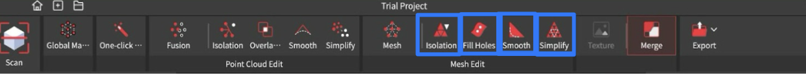

- Isolation: This will discard any meshes outside of the scan. The higher the isolation rate, the more items it will detect, and the smaller the rate, the fewer items. Click “Detect,” then “Apply.”
- Fill Holes: This fills any incomplete parts of the scan, select either plane or curved, depending on the curvature of the model. Click “Detect,” this will outline all the holes in green. Click on the holes you want to fill to turn them red, and once you’ve finished selecting them, click “Apply.”
- Smooth: This smooths the scan and may lose some details in the process. You may adjust the strength and times (higher time takes longer), then click “Apply.”
- Simplify: This helps to reduce the density of the point cloud of a scan. It is favorable if you want to minimize a scan's size for sharing, but most importantly, to reduce the amount of plastic used in 3D printing. This has two options, “Uniform” and “Geometric”. Uniform simplifies the entire design equally, while Geometric is sensitive to detail, making it perfect for when you want to keep more detailed features. Go ahead and click “Apply”. Play with the ratio until the design is simple enough to your liking, but keep the shape intact. Remember, you can always undo (Ctrl/Command Z) if you don’t like the results. 

If there are random artifacts you want to discard that Isolation isn’t detecting accurately, choose the box select, freehand lasso, or polygonal lasso tool on the right to outline the artifact, and then press delete on your keyboard.

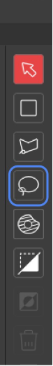

To save the scan, click “File” > “Save.”

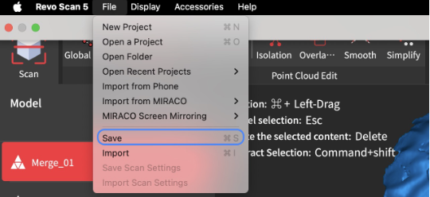

To export the scan, click the Export button on the top bar. Usually, you can select “Mesh Model” from the dropdown menu, if the scan will be displayed in Collection Builder, select "Texture Model".

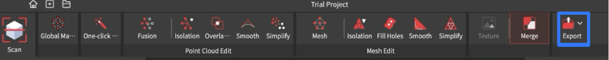

## Conclusion

More editing may be required depending on the quality of the scan, but the models may be uploaded to Collection Builder. 