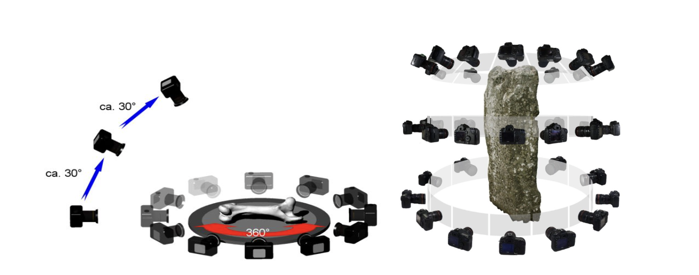
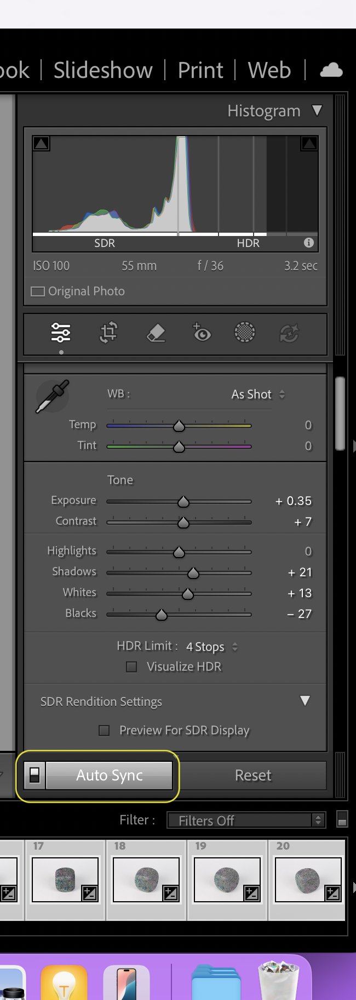
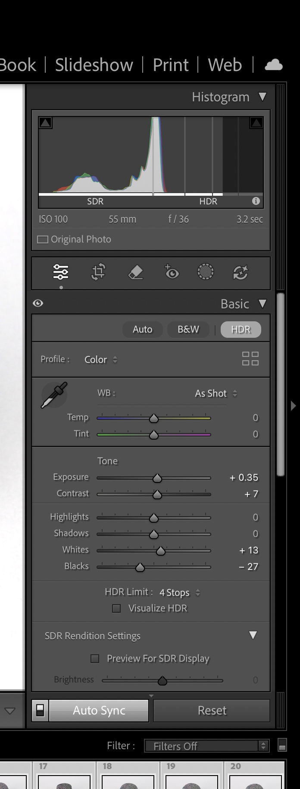
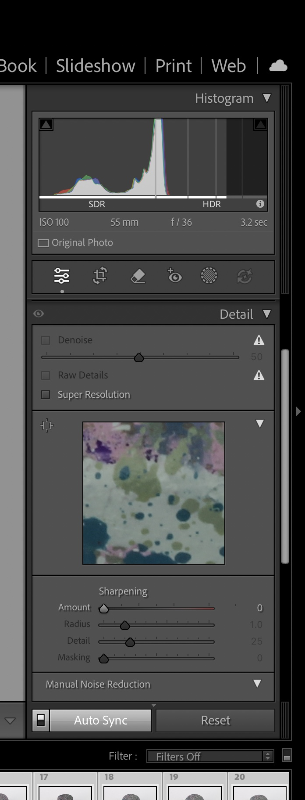
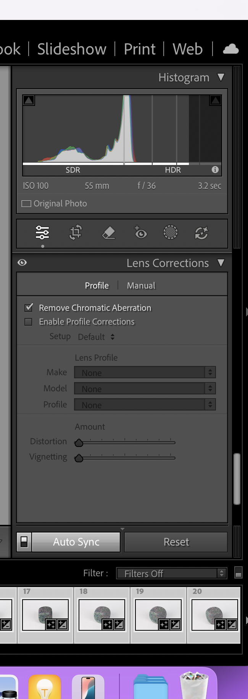
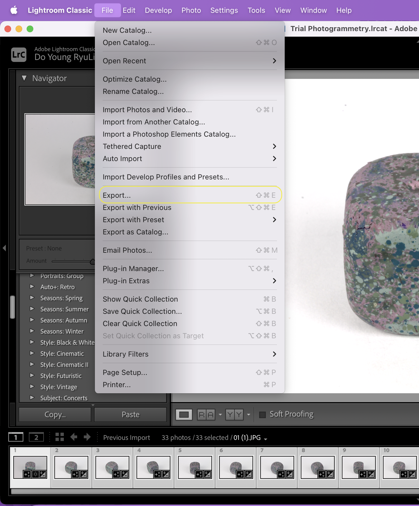
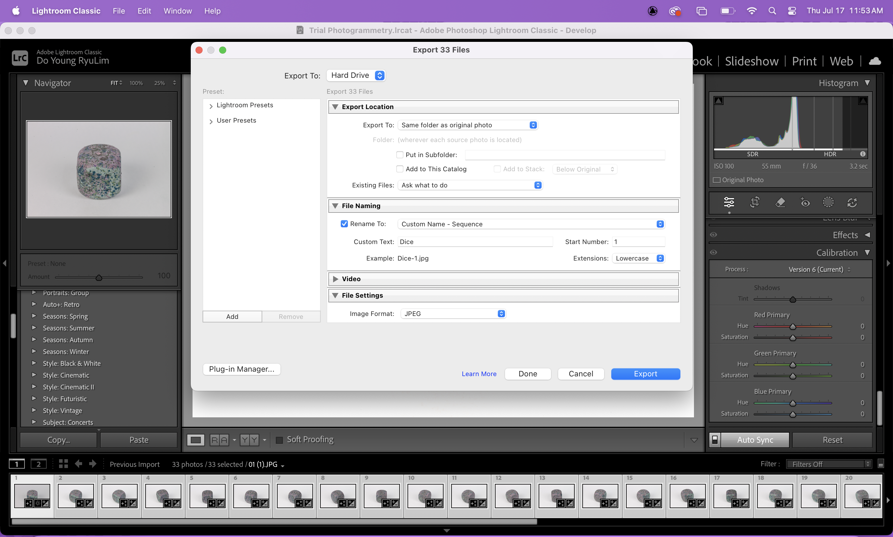
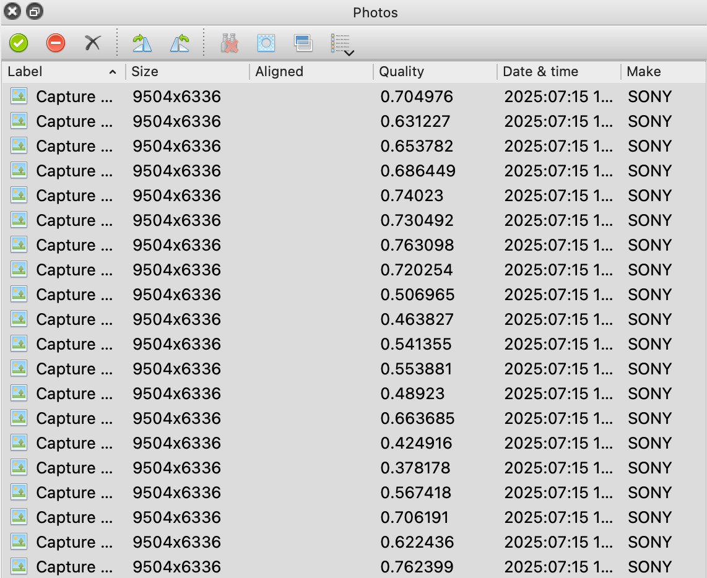
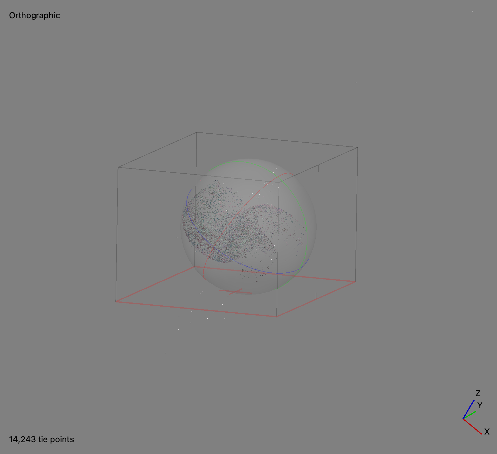
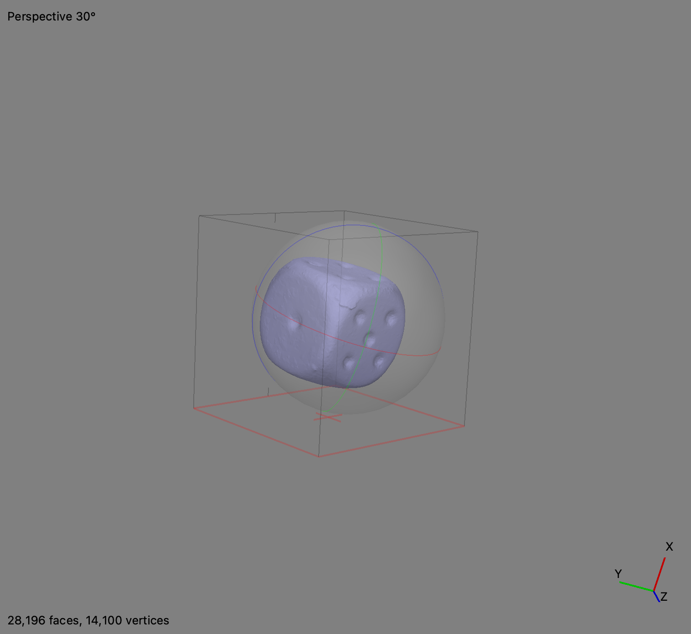

# Photogrammetry Guide

## What is Photogrammetry?

Photogrammetry is the process of obtaining 3D information from multiple 2D images, which can be used for documentation and making measurements. There are two types of photogrammetry: aerial and close-range, it is possible to combine the two. The 2D images must overlap, and while a professional camera is preferred, a newer iPhone will work as well. This method works with keypoint extraction and matching, which are overlapping feature points (pixels) the software can recognize. The drawbacks are that the photos must be free of any sand, snow, fog, overexposure, and/or blurriness.

The uses of photogrammetry may include recreating and reconstructing, tracking time, making models accessible to the general public, VR tours, and 3D printing.

## Prerequisites

You must have the following apps:
- Agisoft Metashape
- Adobe Lightroom 
- Blender

## Step-by-Step Guide

### Photography

Before taking your pictures, make sure your camera has the following settings:
- ISO should be set to the lowest value (high ISO adds noise): Use 400 or lower. 
- The aperture (how far open the lens is to let in light) should be set high enough: Use (f/8 to f/11) to result in sufficient focal depth. 
- Shutter speed (amount of time shutter stays open): Use 1/60th of a second or faster. 
- Use a polarization filter or lens to mitigate glare from reflective objects. 
- Capture from 360 degrees on  three layers in a circle while rotating turntable 5 degrees (or moving around the object in 5 degree increments)

- Continue to take overlapping photos without changing the camera settings
- Don't forget to include a measurement and color correction in some photos for scaling and white balance calibration 

#### Things to Avoid When Capturing Scenarios
- Not enough overlap between shots
- Being too close to object 
- Moving or turning object between shots
- Direct sunlight
- Blur 
- Do not crop or transform images 

:::tip
If the object is really small, you can take the same images in different focus ranges (focus stacking) to get a combination of the images. The camera must remain in the same location, use manual focus and play around with the settings. 
:::

### Editing Images in Adobe Lightroom

This applies to Lightroom Classic.
1. Save image files in a folder on your computer in RAW format
2. Import the photos into Adobe Lightroom (Go to File > New Catalog > Save As > Import)
3. Go to **Develop** option on the top right 

4. On photos that have the color correcting strip, use the color dropper (white balance selector) to click on the white parts of the photo
5. Enable **Auto-Sync** by doing Command + A (Ctrl on Windows) to select all the images, then toggling the Sync button in the bottom right. This applies any changes to all the images 

6. In your right corner under Basic, make the following edits: 
    - Set **highlight** to 0
    - Play with white and black balance
    - You can increase/decrease **exposure** if needed 

8. Lightroom automatically adds **Sharpness**, but that is bad for photogrammetry. Remove this option in the right corner under **Detail**

9. Lightroom automatically adds lens correction, but that is bad for photogrammetry
    - Disable **lens corrector** 
    - Remove **chromic aberration**

10. To export, File > Export Images
    - Put the images in same folder but new format (Either tiff or jpeg but keep in mind that tiff will take longer than jpeg) 
    - Rename the image 
    - Make the **quality** 100

### Building the Model in Metashape

1. To change the scene to Classic (which is lighter), on a Mac, go to the toolbar at the top and select Metashape > Preferences 
    - Under Theme, change the selection from Dark to **Classic**
    - Click **OK**
2. Close and reopen the app to see the new Scene theme
3. It is important to enable GPU and CPU
    - Metashape > preferences
    - Click GPU and check the box at the bottom that says “Use CPU when performing GPU accelerated processing”
    - Click **OK** 
4. Under workspace on the left, you will see “chunk 1” and, the right is where you will see the photos. Sometimes the they may appear at the bottom, but you can move it to the right if you prefer.
5. To add the photos, click the **Add Photos** icon at the top of the workspace (it will be to the left of a green circle with a check mark). You can also drag and drop the photos into the chunk.
6. Check the image quality and make sure it is around 0.5. To do this, right-click on one photo, and then click **Estimate Image Quality**
    - There will be a pop-up, select **All Images** > **OK**
    - Once it finishes processing, you should change the view of the photos to be a list so that you can view the image qualities. 

7. Disable any images that are less than 0.5, do this by right-clicking on the image or selection of images and choosing **Disable Images**
8. Next, we want to align the images.
    - Top Bar > Workflow > Align Photos
    - For Accuracy, select **High**
    - Select **Generic Preselection**
    - Under the Advanced drop-down menu:
        - Set **Key point limit** to 40,000
        - Set **Tie point limit** to 4,000
        - Tip: If the model isn’t aligning well, it may help to increase the tie point limit
        - Click **Exclude stationary tie points**, this will extract the background
        - Click **Adaptive camera model fitting**
        - Click **OK**

9. Under **Images** in the workspace, you should be able to see the total images that were aligned 
10. The boundary box shows what will be calculated in the final model 
11. We want to correct the orientation of the model with the XYZ axes 
    - You can switch between perspective and orthographic view by pressing 5 on the keyboard. Press 7 to change the axis view.
    - At the top toolbar, there are two options in which you can either modify the region, or the object. To move, resize, or rotate the region or object, click the small arrow next to the corresponding button. Adjust the region or object such that the orientation is correct and the region is mostly just the object .
12. To crop any artifacts or unwanted background, click the selection icon at the top toolbar, select everything in the boundary box, then click the crop selection icon on the toolbar to remove everything outside the region.
13. Now, we want to build the model
    - Go to **Workflow** > **Build Model**
        - For Source Data, select **Depth maps**
        - Under Quality, choose **Medium** (high might cause the software to crash)
        - Under Face Count, choose **High**
        - Leave the advanced as default 
        - Click **OK**
14. You can view the model in shaded, solid, wireframe, or confidence mode. You can change this by clicking the pyramid icon in the top toolbar. 

15. Now we want to build the texture 
    - Go to **Workflow** > **Build Texture**
    - Under Texture type, choose **Diffuse Map**
    - Source data: **Images**
    - Mapping mode: **Generic**
    - Blending mode: **Mosaic**
    - Leave everything else as default
16. To decimate the model, at the toolbar at the top, click Tools > Model > Decimate Model. Make the target face count half of what the source face count is and click OK.

To scale the object based on a measurement in some of the photos is a Pro feature. If you have Pro, this tutorial instructs you on how to do so: https://www.youtube.com/watch?v=wR1W1q_gnH0

### How to Reduce File Size for Upload
1. To do so, we want to make a new model at a with fewer polygons through baking 
2. Go to **Workflow** > **Build Texture**
    - Change to **Normal Map**
    - Source Data automatically changes to **3D Model**, choose the highest quality model
    - Leave everything else as default
3. You can't 3D print with a hole in the bottom of the model. To close the hole: 
    - Choose cleaning option under Selection and delete the ground
    - Tools > Model > Close Holes
4. File > Export
    - .stl for 3D printing
    - .obj or .fpx for computer graphics

