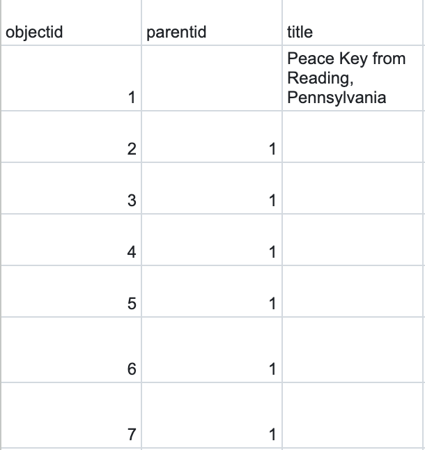
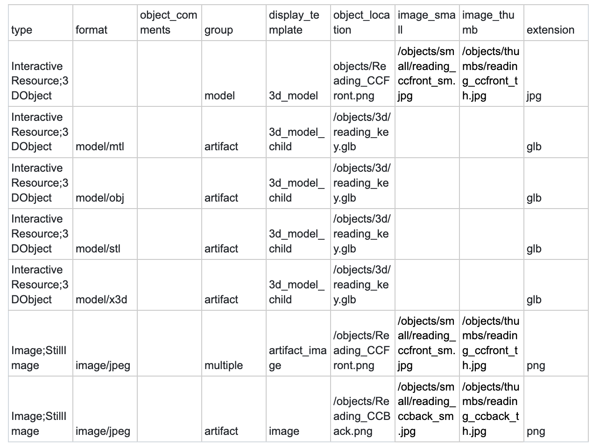
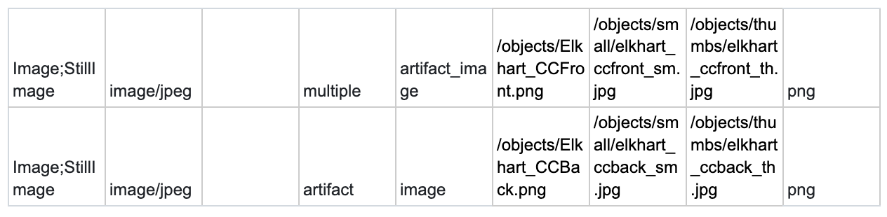

# How to Add Items to Collection Builder

## Pre-requisites

You must have the following installed:
    - Github: https://docs.github.com/en/get-started
    - Jekyll: https://jekyllrb.com/docs/installation/
    - VSCode: https://code.visualstudio.com/download 
    - Brew: https://brew.sh/
    - Ruby: https://www.ruby-lang.org/en/documentation/installation/

## Step-by-Step Guide

- Here is a video that demonstrates the steps described below: https://drive.google.com/file/d/1QhlH_lQVu1rwzb7-ggfVkpMOPFihrX6d/view?usp=sharing 

- There are 3 parts:
    - Uploading images
    - Uploading 3D model (if applicable)
    - Uploading updated .csv file

1. To upload the images, pull the latest version of the repository to VSCode on your local machine. It is sometimes possible to upload directly from the Github website, but the file size for doing so limited.
2. Find the folder of the repository in Finder (this is for Mac, if you're using Windows, find the folder in your computer)
    - You can do this by clicking on Finder, then clicking on “Go” on the top bar, then “Home”. You should be able to find the “liblab_peace_collection” folder.
3. Drag the photos (in PNG format) you would like to upload into the “objects” folder.
4. Next, you want to generate thumbnails and small images. 
    - You must have imagemagick installed for this step. If not, enter “brew install imagemagick” into your terminal
    - Then type the command “rake generate_derivatives” into the terminal and this will automatically create the images.
    - The paths for these images can be found in the “object_list.csv” file in the “objects” folder
5. To upload the 3D model, follow similar steps by dragging the .glb into “objects” > “3d”
6. Lastly, we need to update the artifacts.csv file to pull from these locations. 
    - Go to DS Collection Builder Summer 2025 on Sheets
    - If you’ve added a 3D model, you will need to add 7 additional rows. If you’re just uploading 2D images, you’ll just need to add 2. 
    - There should be previous examples to copy and paste, but here’s what should be filled out and how. 
    - Make sure to continue numbering the **object id** column, and in **parent id**, the first row should be empty, and all following rows should just be the first object id of the item. 

    

    - Enter the **title** in the first row, as shown above. 
    - **Creator** → Enter your initials in only the first row, and the last two rows.
    - Leave **date_archival** empty
    - **Date_is_approximate** → Enter “yes” in only the first row 
    - Fill out the entire column of **identifier** with what the item relates to, i.e. the Peace Keys are from the Great Peace March, so the identifier is Great Peace March.
    - Under **count**, put “1” for the first row and last two rows.
    - Enter **student_initials**, in only first row and last two rows
    - If you’re adding a 3D model, this is what the last few entries should look like:
    

    - The **image_small** and **image_thumb** entries are the paths to the generated images that can be found in object_list.csv. 
    - If you’re just adding 2D images, the entries should just be the last two columns of the example above:
    

7. Download the Sheets as a .csv (File > Download > .csv)
8. Rename it locally as “artifacts.csv”
9. Go back to Finder, and in the “_data” folder, delete the old “artifacts.csv” and replace it with the new one. 
10. Go to your terminal in VSCode and push the changes
    - Git add .
    - Git commit -m “Add new item”
    - Git push